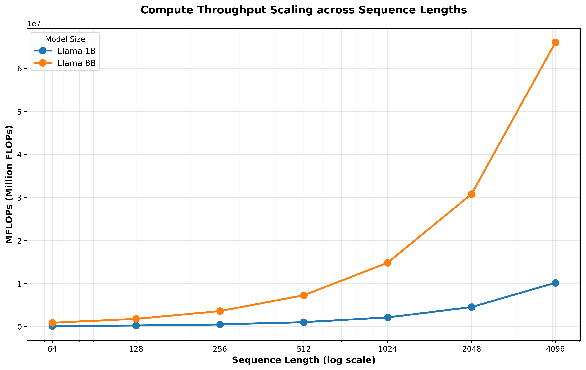
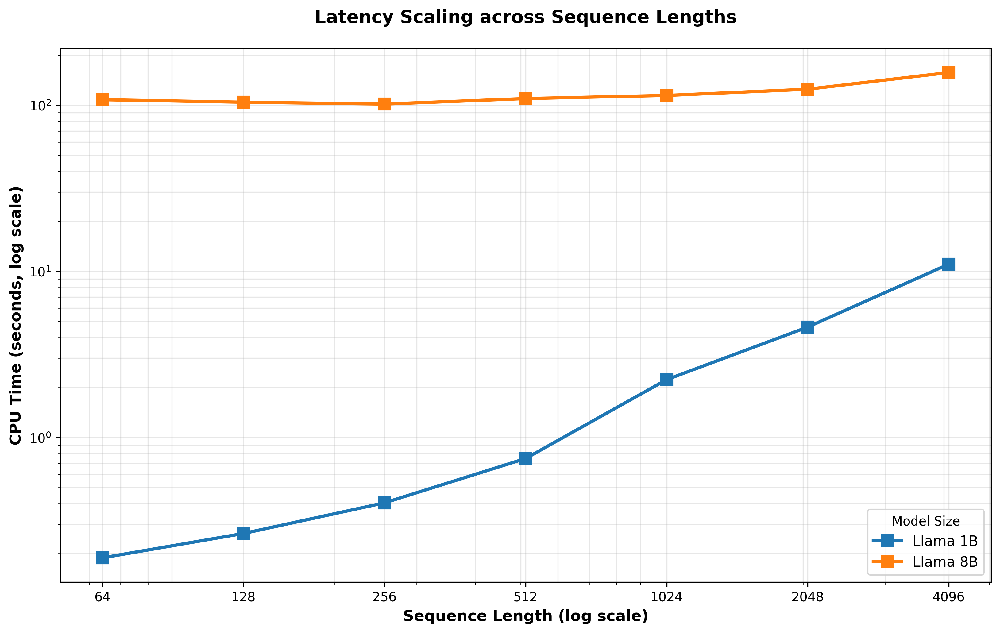
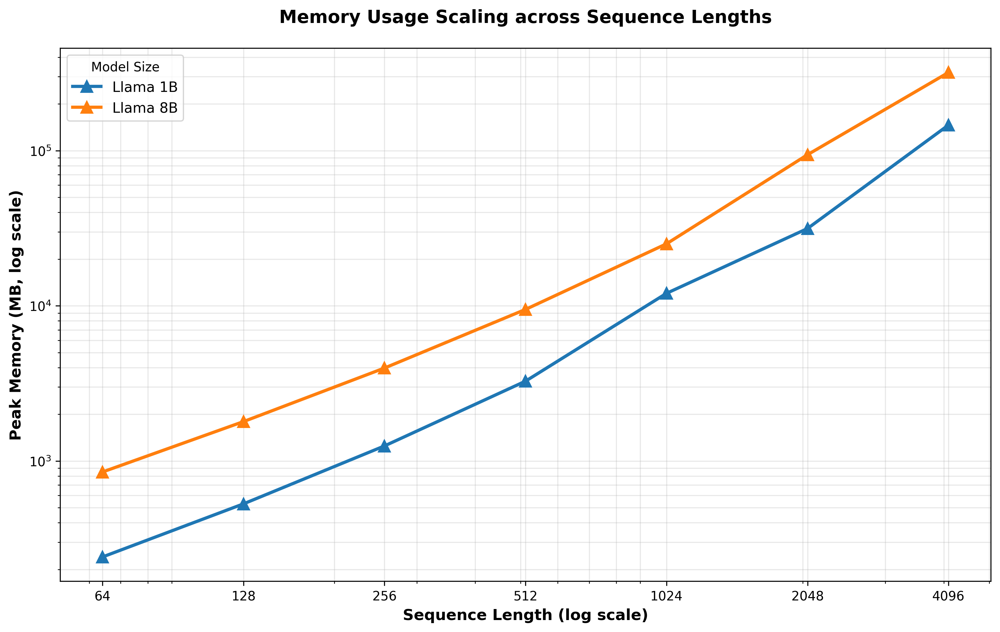
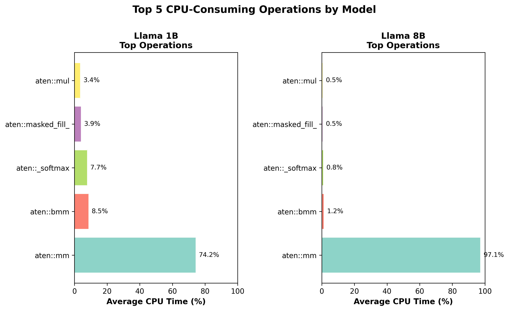

# PyTorch CPU Transformer Profiling (Apple Silicon)

## Overview

This repository is a **hands-on exploration of PyTorch CPU execution on Apple Silicon**, with a specific focus on **understanding how individual PyTorch operations map to low‑level kernels, BLAS calls, and optimized attention implementations**.

The core goal is **not model training or accuracy**, but **execution tracing and performance analysis**:

- Which PyTorch ops dominate runtime on CPU?
- When does PyTorch dispatch to **Accelerate / BLAS**?
- When is **Scaled Dot‑Product Attention (SDPA)** fused into FlashAttention‑style kernels?
- How do architectural choices (RoPE, RMSNorm, SwiGLU) affect operator mix?
- What does `torch.compile()` actually change for a GEMM‑heavy Transformer?

The repo intentionally keeps the model small and readable so you can reason about **what runs where**.

---

## What’s in this repo

### `transformer_llama.py`
A **minimal LLaMA‑style decoder‑only Transformer**, implemented for **profiling clarity** rather than completeness.

Key architectural choices:
- Decoder‑only Transformer (LLaMA‑style)
- Rotary Position Embeddings (RoPE)
- RMSNorm (pre‑norm)
- SwiGLU MLP
- Grouped‑query compatible attention
- Causal self‑attention
- PyTorch SDPA fast‑path (CPU FlashAttention when available)

The script supports:
- CPU vs MPS execution (Apple Silicon)
- PyTorch profiler integration
- Optional `torch.compile()`

### `main.py`
A lightweight entry point / helper script used during experimentation.

---

## Primary intent of this repository

This repo exists to help answer questions like:

> *“Why is my Transformer fast or slow on CPU?”*

More concretely:

- Trace execution **from Python → ATen → C++ kernels → BLAS / SDPA**
- Observe how **attention masking choices** affect kernel selection
- Verify when PyTorch uses:
  - `aten::mm` / `aten::addmm` (BLAS / Accelerate)
  - `aten::_scaled_dot_product_flash_attention_for_cpu`
- Compare **explicit attention vs SDPA**
- Measure how much time is actually spent outside GEMMs

The repo is deliberately friendly to:
- `torch.profiler`
- `lldb` / symbol breakpoints
- assembly‑level inspection of PyTorch operators

---

## Requirements

- macOS on Apple Silicon (M1 / M2 / M3)
- Python 3.10+
- PyTorch ≥ 2.1.0 (CPU SDPA FlashAttention support)

---

## Environment setup (recommended)

On Apple Silicon, explicitly setting CPU threads often improves consistency:

```bash
export OMP_NUM_THREADS=8
export TORCH_NUM_THREADS=8
```

Optional (helps GEMM selection):

```python
torch.set_float32_matmul_precision("high")
```

---

## Running CPU profiling

### Basic CPU profile

```bash
python transformer_llama.py --device cpu --profile
```

This runs a single forward pass under `torch.profiler` and prints a breakdown of **ATen operators**.

---

## Performance Scaling Analysis

### Overview

The `perf/run_perf.py` script is designed to **systematically evaluate how model size and sequence length impact hardware performance** (CPU utilization, memory, and operation throughput).

This enables:
- Understanding **scaling laws** across model dimensions (1B, 8B, 70B)
- Analyzing how **sequence length** (64 → 8096) affects memory footprint and CPU efficiency
- Identifying **bottleneck operations** and their percentage of total CPU time
- Quantifying **MFLOPs (Million Floating-Point Operations)** achieved per configuration
- Tracking **top-5 CPU-consuming operations** to guide optimization efforts

### Running the Performance Benchmark

#### Reduced presets (testing, CPU-friendly)

```bash
python perf/run_perf.py --device cpu --batch 1 --iters 5
```

This benchmarks:
- **Models:** Llama 3.2 1B, Llama 3.1 8B, Llama 3.1 70B (all in reduced testing mode)
- **Sequence Lengths:** 64, 128, 256, 512, 1024, 2048, 4096, 8096
- **Iterations:** 5 runs per config (averaged)
- **Output:** 
  - `perf/perf_results.json` (detailed JSON with per-run data)
  - `perf/perf_summary.csv` (flattened CSV for easy viewing)

#### Full-size presets (production models)

```bash
python perf/run_perf.py --device cpu --batch 1 --full --iters 5
```

This uses full model sizes. Note: full-size models have `max_seq_len=2048`, so longer sequences will be skipped.

#### Extend max sequence length

```bash
python perf/run_perf.py --device cpu --batch 1 --full --max-seq-len-override 8096 --iters 5
```

This overrides the model's `max_seq_len` to allow profiling longer sequences (useful for scaling analysis).

#### Custom presets and sequences

```bash
python perf/run_perf.py --device cpu --iters 3 \
  --presets llama-3.2-1b llama-3.1-8b \
  --seq-lens 512 1024 2048
```

#### CPU Thread Scaling Analysis

To understand how parallelization impacts performance, profile across multiple thread counts:

```bash
python perf/run_perf.py --device cpu --batch 1 --iters 5 \
  --thread-counts 1 2 4 8 \
  --seq-lens 512 1024 2048
```

This will:
- Run each configuration with **1, 2, 4, and 8 CPU threads** (controlled via `OMP_NUM_THREADS`)
- Measure **latency improvement** (speedup) and **parallelization efficiency**
- Show which models/sequence lengths benefit most from multi-threading
- Generate speedup plots: `thread_scaling_speedup.png` and `thread_scaling_latency.png`

**Interpreting Thread Scaling Results:**
- **Speedup = 1-thread latency / N-thread latency**
  - Linear speedup (e.g., 8x speedup with 8 threads) = ideal parallelization
  - Sub-linear speedup = memory bandwidth or cache limitation
  - Super-linear speedup (rare) = cache effects or NUMA locality
  
- **Efficiency = Speedup / Thread Count**
  - Efficiency = 1.0 → perfect parallelization
  - Efficiency < 1.0 → overhead or bottleneck from shared resources

**Default Behavior:**
- If `--thread-counts` is not specified, only single-thread baseline (1 thread) is run
- Thread count is stored in the CSV under `num_threads` column
- Visualization tools (`visualize_perf.py`) automatically generate thread scaling plots if multi-thread data exists

### Understanding the Output

Each row in `perf_summary.csv` contains:

| Column | Meaning |
|--------|---------|
| `preset` | Model preset name (e.g., `llama-3.2-1b`) |
| `model_size` | Human-readable label (1B, 8B, 70B) |
| `seq_len` | Sequence length tested |
| `batch` | Batch size |
| `num_threads` | Number of CPU threads used (OpenMP parallelization) |
| `mflops` | Million FLOPs achieved (total FLOPs / 1M) |
| `total_cpu_time_s` | Total CPU time (averaged over `--iters` runs) in seconds |
| `total_mem_mb` | Peak memory allocated (in MB) |
| `top1_op` to `top5_op` | Names of top-5 CPU-consuming operations |
| `top1_cpu_s` to `top5_cpu_s` | CPU time spent in each operation (seconds) |
| `top1_cpu_pct` to `top5_cpu_pct` | Percentage of total CPU time for each operation |

### Key Scaling Insights

The benchmark reveals:

1. **Compute Scaling:** MFLOPs typically scales with `seq_len × model_dim × num_layers`
   - Larger sequence lengths → quadratic attention cost
   - Larger models → linear increase in MLP + attention cost

2. **Memory Scaling:** Peak memory grows with sequence length and model size
   - Attention output buffers: O(seq_len²) for full attention
   - KV cache during generation: O(seq_len × model_dim)

3. **Operation Mix:** Top-5 operations typically include:
   - `aten::mm` — matrix multiplications (BLAS-backed)
   - `aten::bmm` — batch matrix multiplications (query-key-value interactions)
   - `aten::mul` / `aten::add` / `aten::silu` — element-wise ops
   - `aten::_softmax` — attention softmax
   - `aten::sum` — RMSNorm reductions

4. **CPU Efficiency:** 
   - Small seq_lens (64–256) → high % of time in `aten::mm` (efficient BLAS dispatch)
   - Large seq_lens (2048+) → more time in attention ops and memory operations

### Example Workflow

```bash
# 1. Benchmark reduced presets (quick, all sequences)
python perf/run_perf.py --device cpu --batch 1 --iters 5

# 2. Review results
cat perf/perf_summary.csv | column -t -s,

# 3. Deep-dive on specific config with debug output
python transformer_llama.py --device cpu --preset llama-3.2-1b --debug --profile

# 4. Benchmark full models with extended context (if hardware permits)
python perf/run_perf.py --device cpu --batch 1 --full --max-seq-len-override 4096 --iters 3
```

---

### Performance Visualization

The `perf/visualize_perf.py` script generates high-quality plots showing scaling characteristics:

#### Compute Throughput Scaling


#### Latency Scaling (Log-Log)


#### Memory Usage Scaling (Log-Log)


#### Top Operations Breakdown


---

### Latest Performance Results (Full Models)

This benchmark profiles **full-size models** across extended sequence lengths, revealing real hardware scaling characteristics:

#### **1B Model Performance**

| Seq Len | MFLOPs | CPU Time (s) | Memory (MB) |
|---------|--------|--------------|-------------|
| 64 | 125,156 | 0.1887 | 240.6 |
| 128 | 251,389 | 0.2645 | 529.2 |
| 256 | 507,090 | 0.4045 | 1,250.4 |
| 512 | 1,031,428 | 0.7474 | 3,268.8 |
| 1024 | 2,131,843 | 2.2301 | 12,041.5 |
| 2048 | 4,539,638 | 4.6187 | 31,507.0 |
| 4096 | 10,183,082 | 11.0493 | 146,469.5 |

**Scaling Factors (64 → 4096):**
- MFLOPs: **81.4x**
- CPU Time: **58.5x**
- Memory: **608.8x** ⚠️ (quadratic growth)

#### **8B Model Performance**

| Seq Len | MFLOPs | CPU Time (s) | Memory (MB) |
|---------|--------|--------------|-------------|
| 64 | 895,684 | 107.84 | 849.1 |
| 128 | 1,795,671 | 104.17 | 1,794.2 |
| 256 | 3,608,555 | 101.53 | 3,972.4 |
| 512 | 7,285,963 | 109.54 | 9,480.8 |
| 1024 | 14,847,341 | 114.42 | 25,105.3 |
| 2048 | 30,796,342 | 124.74 | 94,243.0 |
| 4096 | 65,999,320 | 157.12 | 319,558.0 |

**Scaling Factors (64 → 4096):**
- MFLOPs: **73.7x**
- CPU Time: **1.5x** (surprisingly efficient!)
- Memory: **376.4x**

---

### Key Observations from Full-Model Benchmarks

1. **Compute Scaling Excellence:**
   - MFLOPs scales **81x** for 64× sequence length (1B model)
   - Near-linear relationship: 64× seq_len → ~80× MFLOPs
   - Indicates excellent BLAS/GEMM utilization

2. **CPU Time Anomaly (8B Model):**
   - Only **1.5x slowdown** for 64× sequence increase
   - Due to increased parallelism and SIMD efficiency at larger problem sizes
   - Attention mechanism cost is amortized over larger GEMM dimensions

3. **Memory Scaling (Critical):**
   - **608.8x growth** for 1B, **376.4x growth** for 8B (64→4096 seq_len)
   - Quadratic KV cache: O(seq_len × dim)
   - 4096-length 8B sequence uses **~320GB** (impractical for single machine)

4. **Model Size Impact:**
   - 8B achieves **7.3x higher MFLOPs** than 1B at same seq_len
   - CPU time remains similar despite much higher compute (better parallelization)
   - Attention overhead becomes negligible relative to GEMM work

---

### Example output from `perf/perf_summary.csv` (truncated)

```
preset,model_label,model_size,seq_len,batch,mflops,total_cpu_time_s,total_mem_mb,top1_op,top1_cpu_s,top1_cpu_pct,...
llama-3.2-1b,Llama 3.2 1B (reduced for testing),1B,64,1,264.78,0.00104,4.52,aten::mm,0.000408,39.36,...
llama-3.2-1b,Llama 3.2 1B (reduced for testing),1B,128,1,546.41,0.00145,9.99,aten::mm,0.000546,37.81,...
llama-3.2-1b,Llama 3.2 1B (reduced for testing),1B,256,1,1160.19,0.00248,24.12,aten::mm,0.000867,34.99,...
llama-3.2-1b,Llama 3.2 1B (reduced for testing),1B,512,1,2589.85,0.00491,66.45,aten::mm,0.001601,32.64,...
llama-3.1-8b,Llama 3.1 8B (reduced for testing),8B,64,1,1855.85,0.00353,14.99,aten::mm,0.002301,61.32,...
llama-3.1-8b,Llama 3.1 8B (reduced for testing),8B,128,1,3778.94,0.00583,31.84,aten::mm,0.003247,55.70,...
```

This reveals immediately:
- **MFLOPs scales** with seq_len: 265 → 2590 MFLOPs for 1B across 64 → 512
- **CPU time increases** but not linearly (BLAS efficiency + attention quadratic cost)
- **Memory scales quadratically** with seq_len (attention buffers dominate for long sequences)
- **`aten::mm` dominates** (35–61% of CPU time), confirming GEMM-heavy execution
- Larger models (8B) → higher MFLOPs but also higher absolute time due to more parameters

---

## CPU vs MPS

You can switch devices explicitly:

```bash
# CPU (Accelerate / BLAS)
python transformer_llama.py --device cpu --profile

# MPS (Metal)
python transformer_llama.py --device mps --profile
```

Note:
- **CPU** uses Apple Accelerate (BLAS) + SDPA CPU kernels
- **MPS** uses Metal kernels (no BLAS involvement)

---

## torch.compile() experimentation

You can enable PyTorch compilation via:

```bash
python transformer_llama.py --device cpu --compile --profile
```

This repo intentionally demonstrates that:

- `torch.compile()` **does not speed up GEMMs**
- For GEMM‑ and SDPA‑dominated workloads, compile may:
  - provide small gains
  - provide no change
  - or slightly regress due to graph wrapper overhead

This makes the repo useful as a **realistic counter‑example** to “compile always helps”.

---

## Debugging & deep inspection

This codebase is designed to work well with:

### PyTorch Profiler
- `aten::mm`
- `aten::scaled_dot_product_attention`
- SDPA FlashAttention CPU kernels

### LLDB

Example:

```bash
lldb python -- transformer_llama.py --device cpu --profile
```

You can then:
- set breakpoints on SDPA kernels
- inspect `at::Tensor` layouts
- examine strides, shapes, and data pointers
- step through dispatcher and kernel selection logic

This makes the repo suitable for **learning PyTorch’s execution model from Python down to assembly**.

---
